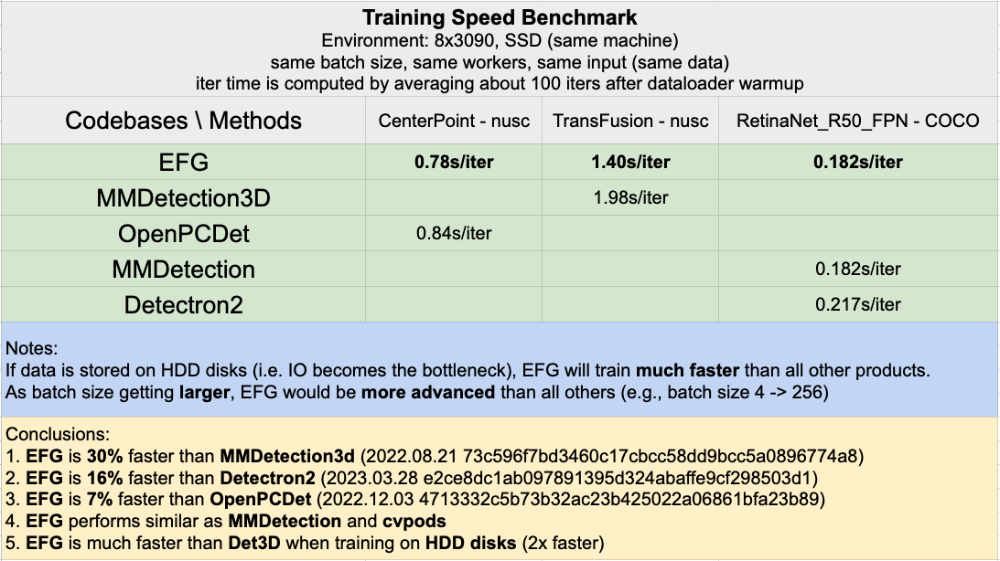

<div align=center><div align=left>
<br/>

An Efficient, Flexible, and General deep learning framework that retains minimal. Users can use EFG to explore any research topics following project templates. 

# What's New
* 2023.04.13 Support COCO Panoptic Segmentation with Mask2Former.
* 2023.03.30 Support Pytorch 2.0.
* 2023.03.21 Code release of CVPR2023 **Highlight** paper: [ConQueR: Query Contrast Voxel-DETR for 3D Object Detection](https://github.com/poodarchu/EFG/blob/master/playground/detection.3d/waymo/conquer/README.md).
* 2023.03.21 Code release of EFG codebase, with support for 2D object detection (MS COCO dataset) and 3D object detection (Waymo and nuScenes dataset).

# 0. Benchmarking
<div align=center><div align=left>


# 1. Installation

## 1.1 Prerequisites
* gcc 5 - 7
* python >= 3.6
* cuda >= 10.2
* pytorch >= 1.6

```shell
# spconv
spconv_cu11{X} (set X according to your cuda version)

# waymo_open_dataset
## python 3.6
waymo-open-dataset-tf-2-1-0==1.2.0

## python 3.7, 3.8
waymo-open-dataset-tf-2-4-0==1.3.1

```
## 1.2 Build from source

```shell
git clone https://github.com/poodarchu/EFG.git
cd EFG
pip install -v -e .
# set logging path to save model checkpoints, training logs, etc.
echo "export EFG_CACHE_DIR=/path/to/your/logs/dir" > ~/.bashrc
```

# 2. Data
## 2.1 Data Preparation - Waymo
```shell

# download waymo dataset v1.2.0 (or v1.3.2, etc)
gsutil -m cp -r \
  "gs://waymo_open_dataset_v_1_2_0_individual_files/testing" \
  "gs://waymo_open_dataset_v_1_2_0_individual_files/training" \
  "gs://waymo_open_dataset_v_1_2_0_individual_files/validation" \
  .

# extract frames from tfrecord to pkl
CUDA_VISIBLE_DEVICES=-1 python cli/data_preparation/waymo/waymo_converter.py --record_path "/path/to/waymo/training/*.tfrecord" --root_path "/path/to/waymo/train/"
CUDA_VISIBLE_DEVICES=-1 python cli/data_preparation/waymo/waymo_converter.py --record_path "/path/to/waymo/validation/*.tfrecord" --root_path "/path/to/waymo/val/"

# create softlink to datasets
cd /path/to/EFG/datasets; ln -s /path/to/waymo/dataset/root waymo; cd ..
# create data summary and gt database from extracted frames
python cli/data_preparation/waymo/create_data.py --root-path datasets/waymo --split train --nsweeps 1
python cli/data_preparation/waymo/create_data.py --root-path datasets/waymo --split val --nsweeps 1

```

## 2.2 Data Preparation - nuScenes
```shell
# create softlink to datasets
cd /path/to/EFG/datasets; ln -s /path/to/nuscenes/dataset/root nuscenes; cd ..
python cli/data_preparation/nuscenes/create_data.py --root-path datasets/nuscenes --version v1.0-trainval --nsweeps 11  # 1 sample frame + 10 sweeps frame (0.5s)
```

# 3. Get Started
##  3.1 Training & Evaluation

```shell
# cd playground/path/to/experiment/directory

efg_run --num-gpus x  # default 1
efg_run --num-gpus x task [train | val | test]
efg_run --num-gpus x --resume
efg_run --num-gpus x dataloader.num_workers 0  # dynamically change options in config.yaml
```
Models will be evaluated automatically at the end of training. Or, 
```shell
efg_run --num-gpus x task val
```


# 4. Model ZOO

All models are trained and evaluated on 8 x NVIDIA A100 GPUs.

## Waymo Open Dataset - 3D Object Detection (val - mAPH/L2)

|    Methods    | Frames | Schedule |  VEHICLE  | PEDESTRIAN |  CYCLIST  |
| :-----------: | :----: | :------: | :-------: | :--------: | :-------: |
|  CenterPoint  |   1    |    36    | 66.9/66.4 | 68.2/62.9  | 69.0/67.9 |
|  CenterPoint  |   4    |    36    | 70.0/69.5 | 72.8/69.7  | 72.6/71.8 |
|  Voxel-DETR   |   1    |    6     | 67.6/67.1 | 69.5/63.0  | 69.0/67.8 |
|    ConQueR    |   1    |    6     | 68.7/68.2 | 70.9/64.7  | 71.4/70.1 |

## nuScenes - 3D Object Detection (val)

|    Methods    | Schedule | mAP  | NDS  | Logs |
| :-----------: | :------: | :--: | :--: | :--: |
|  CenterPoint  |    20    | 59.0 | 66.7 |      |


# 5. Call for contributions
EFG is currently in a relatively preliminary stage, and we still have a lot of work to do, if you are interested in contributing, you can email me at poodarchu@gmail.com.

# 6. Citation
```shell
@misc{zhu2023efg,
    title={EFG: An Efficient, Flexible, and General deep learning framework that retains minimal},
    author={EFG Contributors},
    howpublished = {\url{https://github.com/poodarchu/efg}},
    year={2023}
}
```
