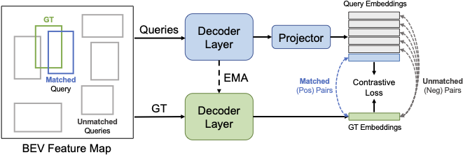

<div align='center'>

# ConQueR: Query Contrast Voxel-DETR for 3D Object Detection (CVPR2023 Highlight)

[Benjin ZHU](https://benjin.me/)<sup>1</sup>&nbsp;&nbsp;&nbsp;
[Zhe WANG](https://wang-zhe.me/)<sup>1</sup>&nbsp;&nbsp;&nbsp;
[Shaoshuai SHI](https://shishaoshuai.com/)<sup>2</sup>&nbsp;&nbsp;&nbsp;
[Hang XU](https://xuhangcn.github.io/)<sup>3</sup>&nbsp;&nbsp;&nbsp;
[Lanqing HONG](https://scholar.google.com/citations?hl=en&user=2p7x6OUAAAAJ)<sup>3</sup>&nbsp;&nbsp;&nbsp;
[Hongshang LI](https://www.ee.cuhk.edu.hk/~hsli/)<sup>1</sup>

<sub>
<sup>1</sup> MMLab, The Chinese University of Hong Kong 
<sup>2</sup> Max Planck Institute for Informatics 
<sup>3</sup> Huawei Noah's Ark Lab 
</sub>

<br/>
<br/>

[Project Page](https://benjin.me/projects/2022_conquer/) / [Paper](https://arxiv.org/abs/2212.07289)

<br/>


Voxel-DETR             | Query Contrast 
:-------------------------:|:-------------------------:
  |  

</div>

## Citation

```
@inproceedings{zhu2023conquer,
  title={Conquer: Query contrast voxel-detr for 3d object detection},
  author={Zhu, Benjin and Wang, Zhe and Shi, Shaoshuai and Xu, Hang and Hong, Lanqing and Li, Hongsheng},
  booktitle={Proceedings of the IEEE/CVF Conference on Computer Vision and Pattern Recognition},
  pages={9296--9305},
  year={2023}
}
```

